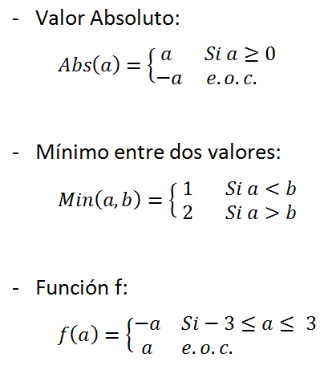

# B Funciones y Operador Condicional

### Usuario github: maxip86
### Legajo: 1562824
### Apellido: Peña
### Nombre: Maximiliano Ezequiel
### Compilador utilizado: MinGW

### Análisis del Problema y el Diseño de la Solución:
1. #### Análisis del problema:
  - ##### Transcripción del problema.
    ##### *Desarrollar las siguientes funciones:*
    - ##### *1.Valar absoluto*
    - ##### *2.Valor mínimo entre dos valores*
    - ##### *3.Función "f"*

    ##### *RESTRICCIONES:*
    - ##### *Las pruebas deben realizarse con assert.*
    - ##### *Cada función debe aplicar el operador condicional*

  - ##### Refinamiento del problema e Hipótesis de trabajo.
      ##### *Se desarrollaran las funciones:*
      - ##### *Función Valor absoluto: la cual retorna la distancia al 0 de un número dado*
      - ##### *Función Valor mínimo entre dos valores: La cual dados dos números indicará cuale es el menor o si son iguales*
      - ##### *Función "f", la cual se define como:
      

  - ##### Modelo IPO.
    ##### *RxR --> Función Valor Absoluto --> R*
    ##### *RxR --> Función Valor Absoluto --> Bool*
    ##### *RxR --> Función --> R*

2. #### Diseño de la Solución:
  - ##### Léxico del Algoritmo.
    ##### *"a" y "b" perteneciente a reales*

  - ##### Definición matemática.
    

  - ##### Representación del Algoritmo:

    - ##### Representación textual.
      ##### *1) Declarar función.*
      ##### *2) Realizar pruebas con assert.*
      ##### *3) Definir las funciones:*
      - ##### *Función Valor absoluto: Abs(double a) {return a > 0 ? a : -a;}*
      - ##### *Función Valor mínimo entre dos valores: Min(double a, double b) {return a < b ? "1" : "2";}*
      - ##### *Función "f": f(double a) {return a >= -3 and a <= 3 ? -a : a;}*
